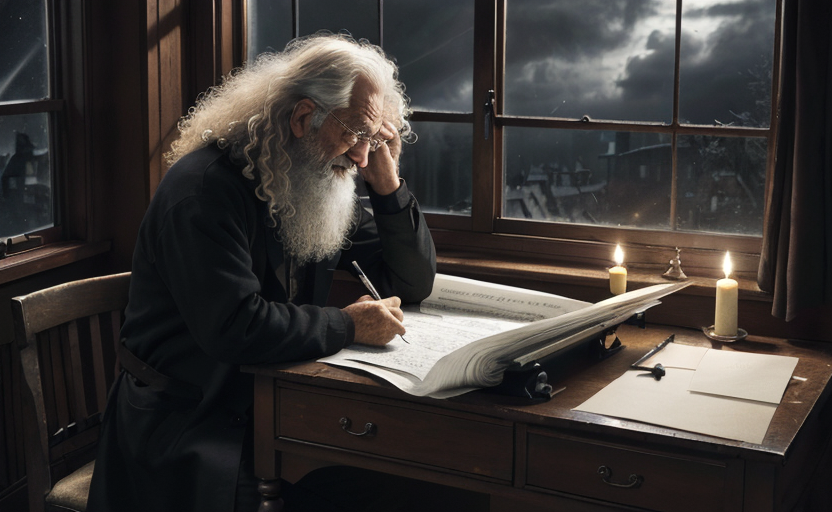

### 序幕

#### 文生图

| 提示词&模型                                                                                                                                                                                                                                                                                                                                                                                                                                                                                                                    | 图片                                               |
| ------------------------------------------------------------------------------------------------------------------------------------------------------------------------------------------------------------------------------------------------------------------------------------------------------------------------------------------------------------------------------------------------------------------------------------------------------------------------------------------------------------------------------ | -------------------------------------------------- |
| best quality,masterpiece,Side view,An old man,Holding a quill pen,Long curly hair, (There is a lot of paper on the desk:1.3),((The open window)),Look out the window, ((dark sky)),cold wind,(Dark clouds),Dim light,candlelight,  Negative prompt: EasyNegative,moon,start,(bad hands),multi-hand,malformed hands  Steps: 20, Sampler: DPM++ SDE Karras, CFG scale: 7, Seed: 1940279540, Size: 832x512, Model hash: e4a30e4607,  Model: majicmixRealistic_v6, ENSD: 31337, Version: v1.2.1 |  |
|                                                                                                                                                                                                                                                                                                                                                                                                                                                                                                                                |                                                    |
|                                                                                                                                                                                                                                                                                                                                                                                                                                                                                                                                |                                                    |
|                                                                                                                                                                                                                                                                                                                                                                                                                                                                                                                                |                                                    |
|                                                                                                                                                                                                                                                                                                                                                                                                                                                                                                                                |                                                    |

#### 配音文案

##### [序幕（云希1.5倍）](../配音/序幕.mp3)

    快看，这个老人名叫艾萨克-牛顿。他快要死了。然而令他恐惧的不是死亡，而是这个自己花费五十年光阴才破解出来的秘密。一个关系到人类过去和未来的秘密。他是该将它长埋心底呢，还是留给某个和自己负担着同样使命的人？
    漫漫长卷，只剩下最后一个篇章了，就如同着长夜里将至未至的黎明，等待揭晓。突然，天空划过一道枝型闪电，“轰！”雷声震耳。牛顿右手一颤，墨水滴落在那叠厚厚的稿纸上，洇成了奇怪的形状。

    刹那间，狂风大作，几扇窗户突然从外向内“乒乒乓乓”地被撞开，桌上那摞叠的整整齐齐的稿纸顿时随风乱舞，纷飞如雪片。牛顿下意识地兜手去抓，却已经来不及了。有的翻卷着冲出窗外，直上夜穹；有的飘摇着落入壁炉，火苗立刻窜腾。顷刻间，半个世纪的心血、数百万字的着作、几千年的秘密……全都七零八落，付诸东流。
    “上帝啊！”他颤声叫着抓起火钳，将那几十张的稿纸从灰烬中拔出来，心口忽然一阵剧痛，“当”地一声，火钳落地，他捂着胸膛踉跄的后退了几步，摔倒在地毯上，脸色青紫。

    “艾萨克勋爵！艾萨克勋爵！”两个仆人提着灯奔入书房。

    窗户大开，垂幔乱舞，他们愣住，看到到处都是翻飞的稿纸。牛顿蜷着身子一动不动。这个欧洲科学界最伟大、最有权势的人物已经停止呼吸。他的左手紧紧握着半张烧焦的纸片，上面只有黑色犹新的三个字——终结日。

#### 原文

##### 序幕     终结日

    那日临近

    势如烧着的火炉

    凡狂傲的和行恶的比如碎秸

    在那日必被烧尽

    根本枝条一无存留

    ——《旧约·玛拉基书》

    1727年3月31日，伦敦。

    风凄厉的叫着，从窗缝、门缝冷飕飕地钻进来，刮得烛火明灭摇曳。艾萨克·牛顿颤抖握紧鹅毛笔，看了看窗外，黑沉沉的天空没有月亮，没有星星，就像一个被宇宙遗弃了的角落。

    他突然感到一阵从未有过的尖锐而森冷的恐惧。

    他快要死了。

    令他恐惧的不是死亡，而是这个花费五十年光阴才破解出来的秘密。一个关系到人类过去和未来的秘密。他是该将它长埋心底呢，还是留给某个和自己负担着同样使命的人？

    漫漫长卷，只剩下最后一个篇章了，就如同着长夜里将至未至的黎明，等待揭晓。主啊，请你给我一个明示。他将左手压在古卷圣经上，闭上眼睛，默默地祷告着。

    天空划过一道枝型闪电，“轰！”雷声震耳。牛顿右手一颤，墨水滴落在那叠厚厚的稿纸上，洇成了奇怪的形状。

    狂风大作，几扇窗户突然从外向内“乒乒乓乓”地被撞开，桌上那摞叠的整整齐齐的稿纸顿时随风乱舞，纷飞如雪片。

    牛顿下意识地兜手去抓，却已经来不及了。有的翻卷着冲出窗外，直上夜穹；有的飘摇着落入壁炉，火苗立刻窜腾。顷刻间，半个世纪的心血、数百万字的着作、几千年的秘密……全都七零八落，付诸东流。

    “上帝啊！”他颤声叫着抓起火钳，将那几十张的稿纸从灰烬中拔出来，心口忽然一阵剧痛，“当”地一声，火钳落地，他捂着胸膛踉跄的后退了几步，摔倒在地毯上，脸色青紫。

    “艾萨克勋爵！艾萨克勋爵！”两个仆人提着灯奔入书房。

    窗户大开，垂幔乱舞，他们愣住，看到到处都是翻飞的稿纸。牛顿蜷着身子一动不动。这个欧洲科学界最伟大、最有权势的人物已经停止呼吸。他的左手紧紧握着半张烧焦的纸片，上面只有黑色犹新的三个字——终结日。
